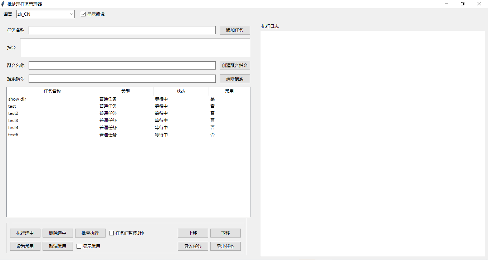
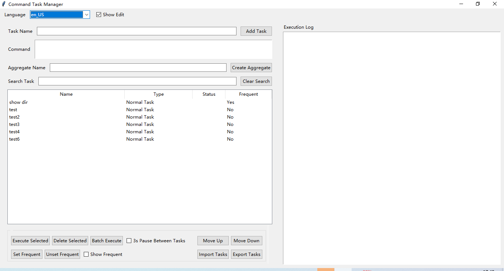

# BAT任务管理器 / BAT Task Manager

[中文](#chinese) | [English](#english)

## 中文说明

### 项目简介
跨平台批处理任务管理器是一个用Python开发的图形界面工具，用于管理和执行Windows批处理命令以及Linux Shell脚本。它提供了一个直观的界面来创建、组织和执行批处理任务，特别适合需要在不同操作系统平台上频繁执行批处理任务的用户。

### 主要功能
- **任务管理**：创建、删除、编辑和组织批处理命令
- **聚合指令**：将多个命令组合成一个任务序列
- **常用任务**：标记和快速访问常用命令
- **任务搜索**：快速查找已保存的任务
- **导入导出**：支持任务配置的导入导出
- **执行日志**：实时显示任务执行状态和输出

### 运行效果

*图片说明：批处理任务管理器中文界面*

### 使用说明
1. **添加任务**
   - 输入任务名称和批处理指令（Windows下为BAT命令，Linux下为Shell脚本）
   - 点击"添加任务"按钮保存

2. **创建聚合指令**
   - 选择多个已有任务
   - 输入聚合名称
   - 点击"创建聚合指令"按钮

3. **执行任务**
   - 单任务执行：选中任务后点击"执行选中"
   - 批量执行：选择多个任务后点击"批量执行"
   - 可选择是否在任务间添加暂停

4. **任务管理**
   - 使用搜索框快速查找任务
   - 标记常用任务便于快速访问
   - 通过上下移动按钮调整任务顺序

5. **数据管理**
   - 使用导入/导出功能备份或迁移任务配置
   - 任务数据自动保存在本地文件中

### 系统要求
- Windows 7/8/10/11 或 Linux（主流发行版）
- Python 3.6或更高版本（如使用源码运行）
- 图形界面环境（GUI支持）

## English Description

### Project Overview
Cross-platform Batch Task Manager is a GUI tool developed in Python for managing and executing both Windows batch commands and Linux shell scripts. It provides an intuitive interface for creating, organizing, and executing batch processing tasks, particularly useful for users who need to work with batch tasks across different operating systems.

### Key Features
- **Task Management**: Create, delete, edit, and organize batch commands
- **Aggregate Commands**: Combine multiple commands into a task sequence
- **Frequent Tasks**: Mark and quickly access commonly used commands
- **Task Search**: Quickly find saved tasks
- **Import/Export**: Support for task configuration import and export
- **Execution Log**: Real-time display of task execution status and output

### Screenshots

*Screenshot: Batch Task Manager English Interface*

### User Guide
1. **Adding Tasks**
   - Enter task name and batch command (BAT for Windows, Shell script for Linux)
   - Click "Add Task" button to save

2. **Creating Aggregate Commands**
   - Select multiple existing tasks
   - Enter aggregate name
   - Click "Create Aggregate Command" button

3. **Executing Tasks**
   - Single task: Select a task and click "Execute Selected"
   - Batch execution: Select multiple tasks and click "Batch Execute"
   - Optional pause between tasks

4. **Task Management**
   - Use search box to quickly find tasks
   - Mark frequent tasks for quick access
   - Adjust task order using up/down buttons

5. **Data Management**
   - Use import/export features to backup or migrate task configurations
   - Task data automatically saved in local files

### System Requirements
- Windows 7/8/10/11 or Linux (major distributions)
- Python 3.6 or higher (if running from source)
- Graphical environment (GUI support)

## 技术栈 / Tech Stack
- Python 3.x
- Tkinter (GUI)
- JSON (数据存储/Data Storage)

当前版本 / Current Version: 0.0.1